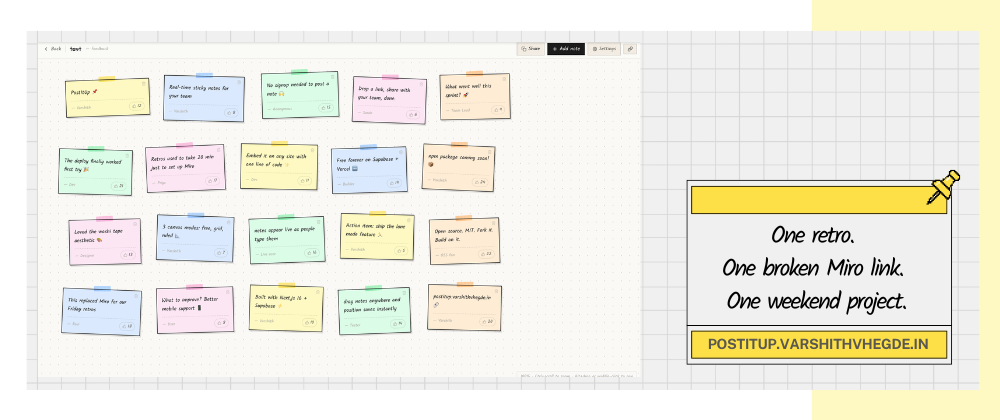
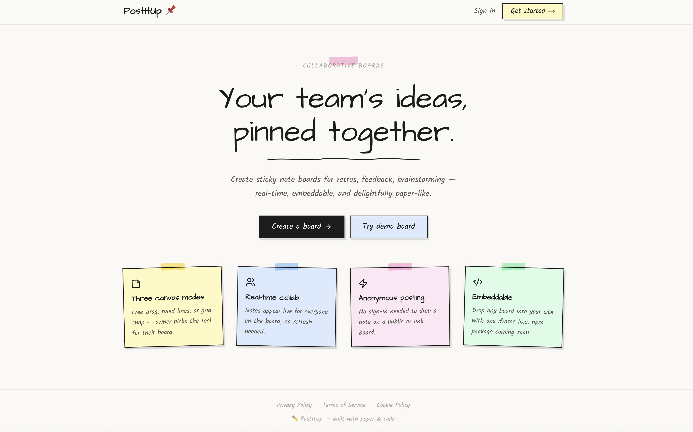
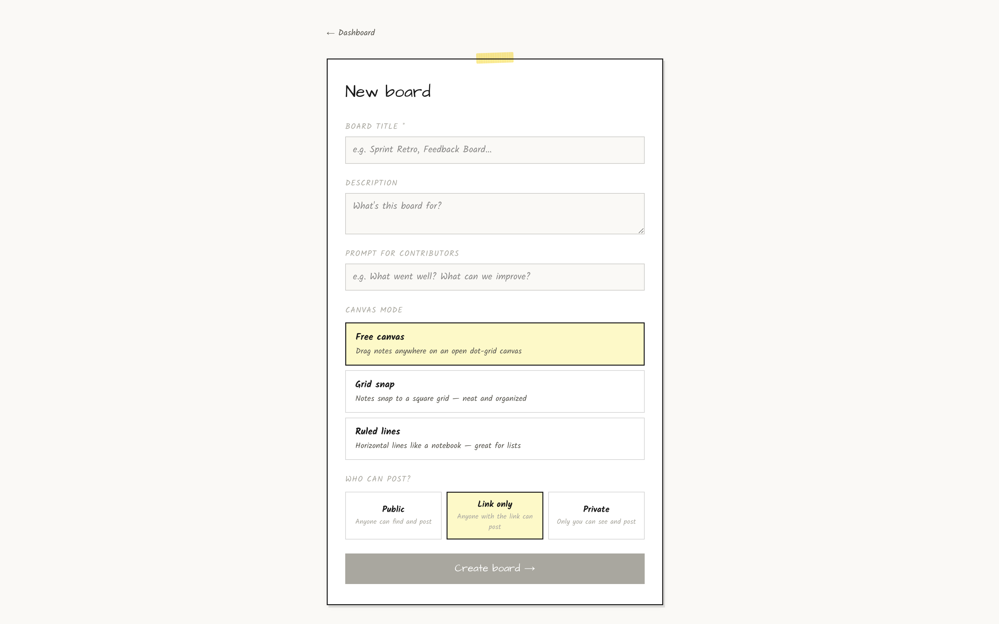
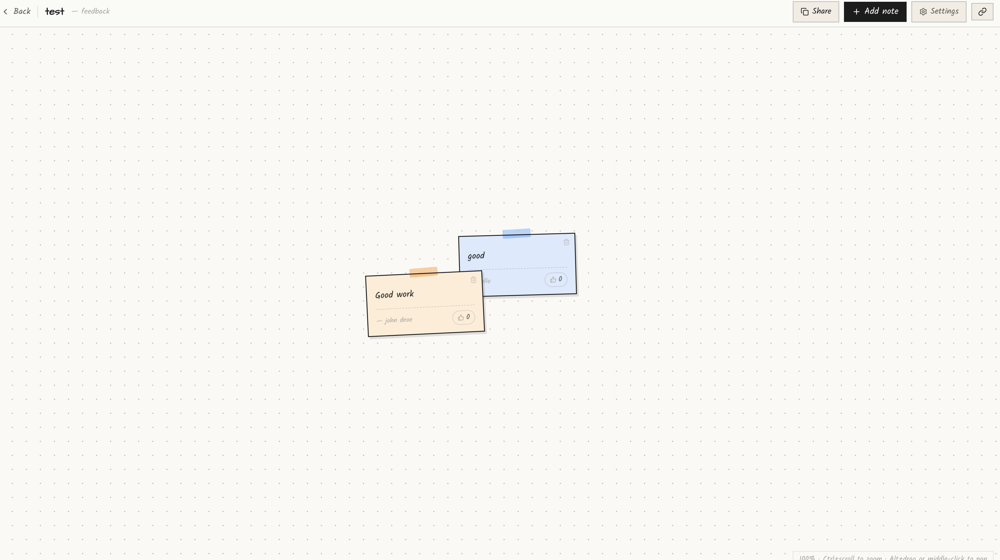
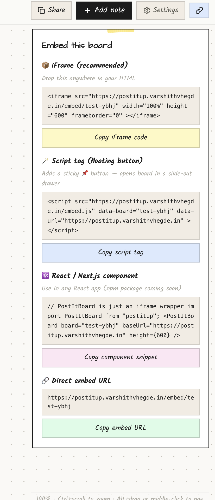

# PostItUp 📌

A real-time collaborative sticky note board for the web. Paper aesthetic, anonymous posting, embeddable anywhere.

**Live:** [postitup.varshithvhegde.in](https://postitup.varshithvhegde.in)

---

## What it is

PostItUp lets you create a board, share a link, and anyone can drop a sticky note in real time — no account required. Think retros, feedback sessions, brainstorming, or just collecting ideas from a group.



---

## Features

- **Three canvas modes** — free-drag, grid snap, or ruled lines
- **Real-time sync** — notes appear live via Supabase Realtime
- **Anonymous posting** — no signup needed on public/link boards
- **Star ratings** — boards can optionally collect 1-5 star reviews shown as cards on the canvas
- **Drag notes** — reposition any note, position saves instantly
- **Upvotes** — thumbs up notes you agree with (one per device)
- **Embeddable** — iframe, script tag, or React component
- **GDPR compliant** — data export and full account deletion built in

---

## Creating a board



Pick a canvas mode, set visibility (public / link-only / private), add an optional prompt for contributors, and optionally enable star ratings.

---

## The canvas



Double-click anywhere to drop a note. Pick a color, write something, add your name. Everyone watching sees it appear immediately.

---

## Embedding



Every board has three embed options from the toolbar:

**iFrame:**
```html
<iframe
  src="https://postitup.varshithvhegde.in/embed/your-board-slug"
  width="100%" height="600" frameborder="0">
</iframe>
```

**Script tag** — floating button with slide-out drawer:
```html
<script
  src="https://postitup.varshithvhegde.in/embed.js"
  data-board="your-board-slug"
  data-url="https://postitup.varshithvhegde.in">
</script>
```

**React component** — npm package coming soon:
```tsx
import { PostItBoard } from "postitup"
<PostItBoard board="your-board-slug" height={500} />
```

---

## Tech stack

| Layer | Tech |
|---|---|
| Framework | Next.js 16 (App Router) |
| Database | Supabase (Postgres + Realtime) |
| Auth | Supabase Auth (email + GitHub OAuth) |
| Styling | Tailwind CSS + custom CSS |
| Fonts | Kalam + Architects Daughter |
| Language | TypeScript |

No UI component library. Wobbly hand-drawn borders are SVG `feTurbulence` displacement filters.

---

## Running locally

```bash
git clone https://github.com/Varshithvhegde/postitup.git
cd postitup
npm install
```

Create `.env.local`:
```env
NEXT_PUBLIC_SUPABASE_URL=your_supabase_project_url
NEXT_PUBLIC_SUPABASE_ANON_KEY=your_supabase_anon_key
SUPABASE_SERVICE_ROLE_KEY=your_service_role_key
NEXT_PUBLIC_SITE_URL=http://localhost:3000
```

Push the database schema:
```bash
npx supabase link --project-ref your-project-ref
npx supabase db push
```

Start the dev server:
```bash
npm run dev
```

---

## Project structure

```
app/
  board/[slug]/           # Board canvas page
  board/[slug]/settings/  # Board settings (owner only)
  embed/[slug]/           # Stripped embed canvas
  dashboard/              # User's boards
  new/                    # Create board
  account/                # Profile, data export, deletion
  legal/                  # Privacy, terms, cookies
components/
  canvas/
    BoardCanvas.tsx       # Full board with toolbar
    EmbedCanvas.tsx       # Lightweight embed version
    RatingsPanel.tsx      # Star ratings panel
  BoardCard.tsx
  BoardSettings.tsx
  AccountPage.tsx
lib/
  supabase/               # Server and client Supabase clients
  sanitize.ts             # Input validation + XSS stripping
supabase/
  migrations/             # All DB migrations in order
public/
  embed.js                # Self-contained script tag embed
  logo.svg                # App icon
  logo-full.svg           # Full wordmark logo
```

---

## Security

- Row Level Security on every table
- Upvotes via `SECURITY DEFINER` DB function — cannot be manipulated from the client
- Input sanitization and length constraints on client and DB
- Auth middleware on all owner-only routes
- `export_user_data()` and `delete_user_account()` DB functions for GDPR compliance

---

## Roadmap

- [ ] npm package (`import { PostItBoard } from "postitup"`)
- [ ] Lane mode (Kanban columns)
- [ ] Board templates
- [ ] Public board discovery

---

## License

MIT — do whatever you want with it.

---

Built by [Varshith V Hegde](https://varshithvhegde.in) · [Dev.to](https://dev.to/varshithvhegde) · [GitHub](https://github.com/VarshithVHegde)
